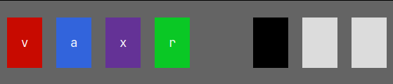

### T5 - Mastermind

Implemente um jogo semelhante ao [mastermind](https://pt.wikipedia.org/wiki/Mastermind), como descrito abaixo.

O programa deve sortear uma sequência de 4 cores, entre sete possíveis, que não se repitam.
O jogador deve adivinhar a sequência de cores sorteada pelo programa.
A cada tentativa, o jogador recebe informações do jogo que avaliam a proximidade da jogada com o segredo.
O jogador tem até 9 chances.

Escolha 7 cores e 7 letras que as representem. Não pode ter preto nem branco. 
Uma jogada é feita digitando uma string de 4 caracteres, todos diferentes, correspondentes às quatro cores que o jogador quer chutar.
Após receber uma jogada, o programa deve validá-la e somente aceitar se contiver 4 cores válidas e não repetidas.
O programa deve aceitar a versão maiúscula ou minúscula das letras que representam as cores.

Após uma jogada, o programa deve imprimir retângulos com as cores correspondentes à jogada, um ao lado do outro, cada um ocupando pelo menos 3 linhas de 5 caracteres cada, com a letra no centro. Ao lado, deve imprimir retângulos correspondentes à resposta: um retângulo preto para cada cor chutada na posição certa seguidos de retângulos brancos, um para cada cor que esteja em posição diferente na sequência secreta.

Se o jogador acertar as quatro cores, serão impressos 4 retângulos pretos, e o programa deve felicitar o jogador e encerrar a partida.
Caso o jogador não acerte na nona jogada, o jogo deve informá-lo do infortúnio e encerrar a partida.

Ao final de uma partida, o jogo deve perguntar se o jogador quer jogar outra.

Além das jogadas, o jogador pode também digitar um comando.
Se o comando for `?`, o programa deve imprimir uma tabela com as cores e as letras que as representam.
Se o comando for `!`, o programa deve mostrar todar as respostas que já deu na partida.
Acrescente um comando para desistir da partida.

#### Exemplo

Se as cores secretas são "XVBR" e o chute do jogador é "vaxr", a resposta do programa pode ser algo assim:


#### Regras de formatação

- Nenhuma função do programa deve ter mais de 22 linhas entre o '{' inicial e o '}' final. (*main* é uma função do programa).
- Nenhuma linha deve ter mais de um ';'.
- Em linhas que contenham o caractere '{', esse deve ser o último caractere da linha.
- Em linhas que contenham o caractere '}', esse deve ser o único caractere da linha que não é um espaço.


#### Dicas

Como organizar o programa.

Podem ser jogadas várias partidas, então o programa deve conter um laço como:
```
apresentação
repete
  joga uma partida
  pergunta se quer jogar mais
enquanto o usuário quizer jogar
despedida
```

Uma partida consiste de um certo número de jogadas, algo como:
```
inicializa a partida (sorteia as cores)
repete
  lê uma jogada
  se for especial (inválida,!,?,...)
    processa jogada especial
  senão (jogada normal)
    calcula resposta
    mostra jogada e resposta
até adivinhar ou desistir ou acabarem as chances
```
